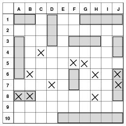
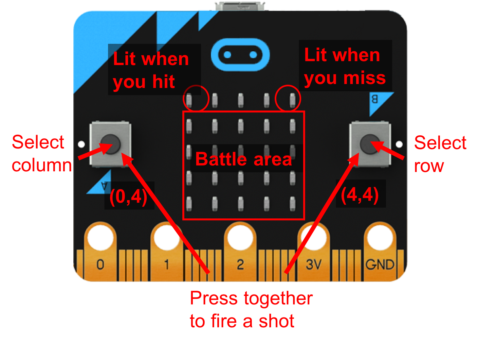
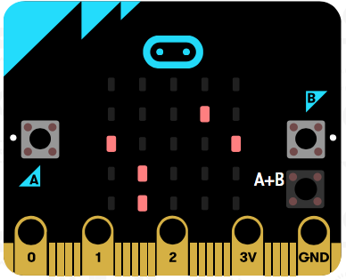
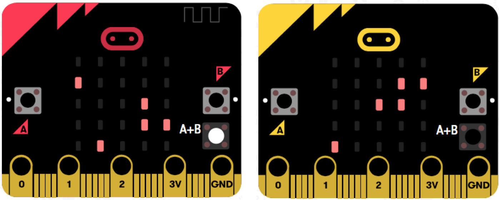

Game 3: Battleship over Radio
=============================

Introduction
------------

In this activity, you will program the micro:bit version of a famous
classic game called Battleship. Battleship has been played since World
War 1 with pencil and paper[^1]. A plastic board game was released in
1967, and now, there are several electronic versions and apps! [^2]

!!! note ""
	**Figure 1:** Battleship board

Let's look at how this game works using the example board in the figure above.  
In this example, each player uses their own 10x10 board, and each player's fleet includes
10 ships of different sizes (the grey rectangles). The figure shows the placement for one of the players: 4
ships of size 2, 3 ships of size 3, 2 ships of size 4, and 1 ship of
size 6. Arrangement of the ships is hidden from the opponent.
Once both players have placed their ships
on their boards, they start guessing the position of (i.e., shooting at) their opponent's ships.
In the example board, the crosses mark the shots of the opponent. Notice that some
of these crosses did not hit any ships, and some of them did. The
opponent has sunk the ship on squares 8A-8B. The ship on the
squares 6J-7J-8J was hit twice. Another shot on 8J will sink it. The
players keep a second board to mark the shots they have already tried. They
record each hit and miss to decide which shot to fire next.

To program the Battleship into your micro:bits, you will use your networking knowledge. This
game requires unicast and bidirectional communication, which you learned about in [Unicast Communication: One to One](../unicast/unicast.md) and [Two way unicast](../twowayunicast/twowayunicast.md). If you program
the variants in Exercises, you will use information from
 [Handling errors: Retransmissions](../retransmissions/retransmissions.md) and [Handling errors: Acknowledgements](../acknowledgements/acknowledgements.md). 
In summary, you
will practice:

- The concept of *unicast communication* and *two-way communication*

- Sending and receiving messages

- Button inputs

- Display and its coordinates

- Variables and random numbers

- Arrays

- Loops

### What you’ll need

    2 micro:bits
    1 teammate

Designing the Battleship for Microbit
-------------------------------------

### How the game works

Let’s start with going over the different pieces we need to program the
Battleship game. In the section above, you saw an example of the game, with a 10x10 board.

**Using the micro:bit display as a Battleship board:** Since micro:bit has a
5x5 display, your battleship board needs to be smaller.
 This does not allow for many ships or big ones. So, your fleet will be 5 ships, each with a size just 1.

 When you fire a shot, you will need to know if it was a hit or a miss. So, we need to reserve the top row to display hits and misses. If your opponent's micro:bit says you had a
hit, your micro:bit will light the leftmost LED. If it was an unfortunate
miss, your micro:bit will light the rightmost LED.

Since your micro:bit has a limited display, you won’t be able to show  your tries
and misses on the screen. Maybe, that's a memory challenge that can be added to the game, 
or you can keep track of these with
paper like the children who played the game in earlier times?

**Firing shots:** To fire shots, you will use the buttons. You will select a row and a
column number to fire a shot. Note
that when LED’s coordinates are given as *(x,y)*, x is column number, and
y is the row number. For more information, see  
[https://microbit.org/guide/hardware/leds/](https://microbit.org/guide/hardware/leds/).

!!! note ""
	**Figure 2:** Battleship in micro:bit

Button A will be used to select the column number and button B will be
used to select the row number. Then to fire a shot to (2,3), you will
need to press button A twice, and press button B three times, and press both buttons A and button B together.  To check your understanding, discuss with your
teammate how you can send a shot to (0,4).

When you press both buttons to fire a shot, your program will send a message to
your opponent’s micro:bit. So, for example, if you want to fire a shot at (4,4), you will
send the coordinates (4,4). When your opponent’s micro:bit receives a
shot, it will check whether it is a hit or a miss: It will send a
message back with its radio saying either it is a “Hit” or a “Miss”.

When you receive a “Hit”, you will light up the LED on the left corner
of the top row. When you receive a “Miss”, you will light up the LED on
the right corner of the top row.

### An example game

Let’s see how things will look like in your micro:bits. In the
beginning, you will have all your battleships placed in the lower 4 rows
as in the figure below. The figure shows both
players have 5 ships placed in the battle area.

!!! note ""
	**Figure 3:** Battleship game: Initial stage with randomly placed ships.

The attacker (on the left) presses button A three times, and button B
once. Pressing both buttons at the same fires a shot, and sends a
shot message over the radio for the position (3,1). There is a ship on
this location, and so, this is a hit! In the
figure below, the leftmost LED in the top row of the
attacker’s micro:bit lights up. And, on the opponent’s display, the LED in
the position (3,1) gets turned off, because this ship was sunk.

!!! note ""
	**Figure 4:** Battleship game: Success! You hit a ship!

Let’s also look at a miss situation (see
the figure below). In this case, nothing should change on
the opponent’s board. But, in the attacker’s display, in the top row,
the rightmost LED lights up to show a miss.

!!! note ""
	**Figure 5:** Battleship game: You missed!

Programming: Battleship
-----------------------

Battleship is a two-person game. Both players can run identical problems, or you can program your own versions, as long as you agree on the details of the radio messages. When writing a more complex program like this, you will find it easier if you split up into parts, and test each part as you write it. (This is a valuable skill as you learn more about programming!)

To help with this, we have split the program into four tasks: once you have completed the final task, you will be able to play the game with your teammate. 

### Task 1: Setting up the game

**Description:** This part needs to take place before the game starts.
You will place 5 ships on your board. Think about randomly placing 5
points in the battle area, which is a 4 x 5 matrix. Answer the following
questions:

- Which data structure will you pick to represent the battle area?

- How will you select random coordinates (*column\_number*,
    *row\_number*) for 5 ships, where *column\_number* is between 0 and 5, and *row\_number* is between 1 and 5?

- How will you represent the information that there is a ship at each of these coordinates?

In this task, you will also set up your radio and packet configuration to send unicast messages.

**Instruction:** Create the necessary data structures and variables that represent the ships in the battle area. Set up your radio and packets
for unicast communication. Test whether your program displays 5 ships randomly
placed on the lower 4 rows of the display, like in the example figures.

### Task 2: Firing a shot

**Description:** When button A is pressed, it indicates the
*column\_number* for a shot. So, you need to count how many times this
button was pressed to get the *column\_number*. When button B is
pressed, it defines the *row\_number* for the same shot. Again,
count the number of times to get the *row\_number*.

**Important:** If you do not press either button A or button B, the
*column\_number=0* and *row\_number=1*.
Also, make sure if either button is pressed more than four times, it should start counting again from 
their initial values. In other words, the button counters should
increment with each button press like this for the column counter: 0, 1, 2, 3, 4, 0, 1, 2,
3, 4. Or like this for the row counter: 1, 2, 3, 4, 1, 2, 3, 4.

Pressing both buttons together will send *column\_number* and
*row\_number* over the radio to your opponent. Decide how to send this
message in a packet. Agree on this with your teammate if you are writing separate programs.

**Instruction:** Program the button presses for A, B, and A+B. The
program piece for buttons A+B will send a radio message.
To visually aid the coordinate selection, when either button is pressed, you may want to
clear the screen to display the selected coordinates. Then, after firing the shot,
you will need to "refresh" your screen to view your remaining battleships.

### Task 3: Receiving a shot

**Description:** When you receive a shot, you will check whether you
have a ship on the (*column\_number*, *row\_number*) of the shot.
If you have a ship there, then it was hit and sunk. You will send a
“Hit” message to your opponent, and remove the ship from the display. If it is a miss, send a
“Miss” message too your opponent.

**Instruction:** Depending on how the packet was formatted, decode
(*column\_number*, *row\_number*) from the received packet. If you have
a ship on (*column\_number*, *row\_number*), it is a hit: Turn off the
LED in that position. If you have a separate data structure to represent your ships, update that too. Send your opponent a “Hit” message. If it is a miss, send a “Miss” message to your opponent.

### Task 4: Receiving the shot result: “Hit” or “Miss”

**Description:** Turn on LEDs in the top row depending on the outcome.
If it is a “Hit”, check if you reached 5 hits. Then you won! Display a
smile!

**Instruction:** If you receive a “Hit”, light the leftmost LED of the top row (the LED in (0,0) position). Update the count of your hits,
and if you reached 5, display a smile! If the result was a “Miss”, light the rightmost LED of the top row (the LED in (4,0) position).

Test your program(s) with your opponent. To start with, it'll be easier if you can see each other's screens. You might find it helpful to put in some test code like you did for the previous task. For example, you could print out "hit" or "miss" when you receive and decode a shot. You might even find it helpful to display the coordinates you
received from your opponent.

Extended Activity
-----------------

Battleship game has many variations. See the Wikipedia site in Resources
to read about the variations.
To handle these variations, you will look back to how you dealt with packet losses in [Handling errors: Retransmissions](../retransmissions/retransmissions.md) and [Handling errors: Acknowledgements](../acknowledgements/acknowledgements.md). You will think about how you would apply those concepts to this case.

!!! attention "Exercise 1"
	One variation allows players to keep it secret that a ship has been sunk. So, their opponent has to take further shots to confirm that an area is clear. This is like having a packet loss! Discuss possible solutions with your friend. Then, program and test your new solution.

!!! attention "Exercise 2"
	Imagine a variant when it takes 3 hits to sink a ship instead of 1 hit. How would your program change? Do you need to make changes on the sender side or the receiver side?

!!! attention "Exercise 3"
	Another variation makes your ships use experimental missiles which have a high chance of exploding midair. If this happens, you won't know whether your shot was going to hit or miss once it landed. Firing multiple shots (retransmissions) at the same coordinate will hopefully allow at least 1 missile to land. Have a go at designing and programming this yourself, you'll need to create a function that sends multiple shot messages  with each one having a chance of failing.  Experiment with different probabilities of failure and with different number of missiles fired.

Problems
--------

!!! note ""
	**Figure 6:** Battleship game: A random battle area

**Problem 1:** The figure above shows randomly placed ships in a battle area. Which coordinates do you need to send to hit all the ships?

!!! note ""
	**Figure 7:** Battleship game: Two players

**Problem 2:** The figure above shows randomly placed ships in the battle areas of two micro:bits. The table below lists all the shots that are fired from the micro:bit 1 (left/red micro:bit) and micro:bit 2
(right/yellow micro:bit). Who wins?

| **Rounds** | **Micro:bit 1** | **Micro:bit2** | **Result** |
|------------|:----------------|:---------------|:-----------|
| 1 | (3,1) | (2,1) | |
| 2 | (0,3) | (0,1) | |
| 3 | (1,1) | (3,2) | |
| 4 | (4,1) | (3,3) | |
| 5 | (0,3) | (4,3) | |
| 6 | (2,2) | (0,3) | |
| 7 | (3,2) | (1,4) | |

If you wanted to play this game with another opponent, what do you need
to change in your program?

Solutions
---------

Solutions for this chapter can be found under microbit-networking-book-python/battleship/code

[^1]: Battleship in Wikipedia: [https://en.wikipedia.org/wiki/Battleship_(game)](https://en.wikipedia.org/wiki/Battleship_(game))

[^2]: Online Battleship game 1: [https://battleship-game.org](https://battleship-game.org) and Online Battleship game 2: [http://www.mathplayground.com/battleship.html](http://www.mathplayground.com/battleship.html)
