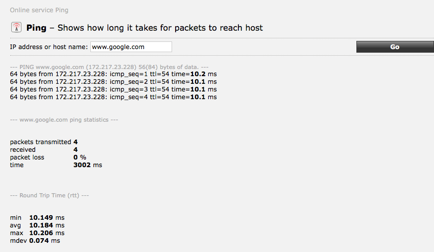

Two-way unicast
===============


Introduction
------------

In this chapter, you will learn about *bidirectional communication*:
sending a message to another micro:bit and getting a response to
your message. You will also learn about the Ping program, which is a
commonly used tool to check if computers are still connected to the
Internet.

This chapter will build on the learnings from
[Unicast Communication: One to One](../unicast/unicast.md). The new ideas are:

- The idea of 2-way communication (*bidirectional communication*)

- The Ping program

- The concept of round-trip-time

### What you’ll need

    2 micro:bits
    1 whiteboard/board
    boardmarkers/postit notes
    1 teammate

Background
----------

*Bidirectional communication* enables two-way communication between two
computers.

!!! hint "Definition 1: _Bidirectional communication_"
	This is a communications mode in which
	data is transmitted in both directions but not at the same time.

In the previous chapter, your micro:bits had clear roles: there was a
sender and a receiver. In bidirectional communication, either of the
micro:bits can send and receive messages. This way, it becomes possible
to create two-way protocols. In these protocols, when a computer sends a
message, it waits for a certain response to its message.

!!! hint "Definition 2: _Ping_"
	Ping is an example of a two-way protocol. It is widely used in
	the Internet to test whether a networked computer is on and connected OK.

Ping program sends a *Ping* message to test whether computers are OK. It
expects this message to be echoed back, for example with a *Pong*
message. This is like playing ping pong but with computers and over
networks. If the sender does not receive a response to its *Ping*, this
shows there is a problem with the receiver. It is also a problem if it
takes a long time before the sender receives a *Pong* response.

So, Ping program measures the *round-trip-time* between the two
computers to point out these problems.

!!! hint "Definition 3: _Round-trip-time (RTT)_"
	Round-trip-time is the time it takes for a
	message to go from a sender to a receiver and back again.

In other words, the sender measures the difference in time when it sent
the *Ping* and when it received the *Pong*.  

RTT = Time\_receive\_pong - Time\_send\_ping  

The figure below shows the relationship between,
*Ping*, *Pong*, and round-trip-time.


!!! note ""
	**Figure 1:** Round-trip-time. Micro:bit 1 sends a *Ping* message to 
	Micro:bit 2 at *Time\_send*. The Micro:bit 2 responds with a *Pong* message. 
	Micro:bit 1 receives the *Pong* message at *Time\_receive*. The difference 
	between these two times, *Time\_receive* and *Time\_send* is the round-trip-time.

Besides round-trip-time (RTT), the Ping program reports statistical
information. Figure below shows an example output as a result of
using the command:

    ping www.google.com

on the <http://ping.eu/ping> website. In this example, four Ping messages were sent to *www.google.com*.
The round-trip-time for each message is given with the *time* value in
each line. For example, for the first ping, the RTT is 10.2 ms
(milliseconds). The program also reports ping statistics. For example, 4
packets were sent, 4 packets were received. This means 0% packet loss.
The average RTT (shown as *avg*) is 10.184 ms.



!!! note ""
	**Figure 2:** The output of running ping to send four messages to *www.google.com*. 
	The <http://ping.eu/ping> online program reports round-trip time and a 
	statistical summary of the results.

With a micro:bit, to calculate the round-trip-time of your messages, you
will use the *running time* variable.

!!! hint "Definition 3: _micro:bit running time_"
	A variable that keeps record of how long has passed since the micro:bit was
	turned on or reset (measured in milliseconds).

In the rest of this chapter, you will use the running time variable to
calculate the round-trip time. It will be very useful to record the time
when you first sent a message, and also when you received a response.
**Hint: Recording running time means setting a variable equal to the
current running time. You can use this command to get the current running time of the microbit:**
```Python
running_time()
```

Programming: Ping
-----------------

This activity is best done with a team of two. You will together program
your micro:bits to run the Ping program. For this, you will need to
complete four tasks.

### Task 1: Prepare for unicast

**Description:** Ping uses unicast between the sender and the receiver
micro:bits. Look at your notes for [Unicast Communication: One to One](../unicast/unicast.md)  and your
unicast program to remember how to do unicast.

**Instruction:** Start with using the unicast program you have written for
[Unicast Communication: One to One](../unicast/unicast.md) as a basis. In this program, decide which
micro:bit is going send the *Pings*, and which micro:bit is going to
respond with *Pongs*. Set the address variables based on your decision.
Design your message header, *Ping* packet, and *Pong* packet.

### Task 2: Send a Ping

**Description:** The ping sender records the time before it sends out a
*Ping* packet. It unicasts the *Ping* packet.

**Instruction:** Use *running time* to record the *Ping* sending time.
Send a *Ping* packet to the receiver micro:bit.

### Task 3: Receive a Ping

**Description:** The receiver micro:bit responds a *Ping* message with a
*Pong*.

**Instruction:** Program the receiver micro:bit to unicast a *Pong*
packet when a *Ping* packet is received.

### Task 4: Receive a Pong and calculate round-trip-time

**Description:** When the sender micro:bit receives the *Pong*, it
calculates the round-trip-time. 

**Instruction:** Program the sender to
receive a *Pong* packet. When the *Pong* is received, record the time
using the running time variable. Show the difference between receiving
and sending times on your display. Run your program 5 times, and write
down the send times that you see in your display. Answer these two
questions:

1. What is the minimum and maximum round-trip-time (RTT)?

2. What is the average RTT?

Exercises
---------

!!! attention "Exercise 1"
	Extend your Ping program to send automatically more than one *Ping* message. 
	Test it with 10 *Pings*. Calculate the average round-trip time of these Ping messages.

!!! attention "Exercise 2"
	The Ping program reports the round-trip-time. What if you wanted to calculate 
	the time the message took one-way? Is it possible to calculate one-way times? 
	In other words, is it possible to calculate how long it takes to send a message 
	from the sender to the receiver? How long the messages take from the receiver to the sender?

Problems
--------

1. In the example ping figure from the <http://ping.eu/ping> site, what is 172.217.23.228?

2. What is round-trip-time, and how is it calculated?

3. Think about the following scenario: micro:bit 1 sends a *Ping* to micro:bit 2 at time *5*. If the round-trip-time is *10*, at what time did the micro:bit 1 receive the *Pong* message?

4. In the example ping figure from the <http://ping.eu/ping> site, what are the minimum and maximum round-trip-times (RTTs)?

5. In the example ping figure from the <http://ping.eu/ping> site, the packet loss 0% loss. What is the loss percentage, if 2 *Ping* messages were lost out of 5?

Resources
---------

Video: What is a Ping? - <https://youtu.be/N8uT7LNVJv4>
